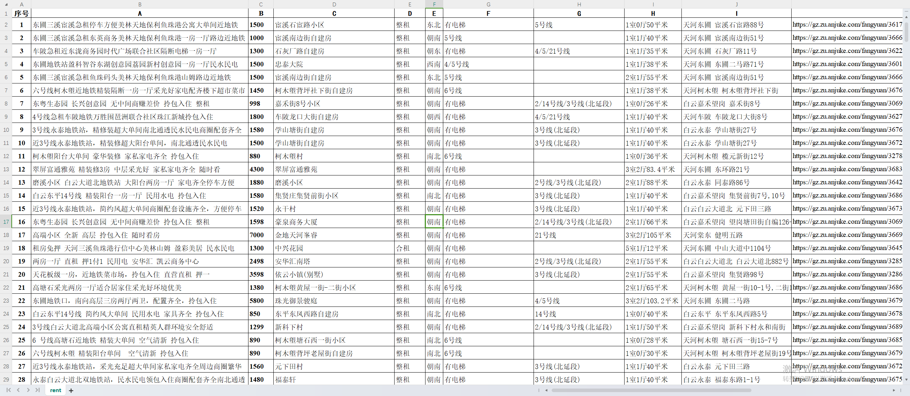

### RentHouse Scrapy
---

#### 介绍
---

本项目从"安居客"爬取租房信息,结果存储在rent.csv文件中

Scrapy 2.6.3

Python >= 3.6

#### 使用方法
---

运行命令
`
cd rentHouse;scrapy crawl rent
`

默认起始URL
`
https://gz.zu.anjuke.com/?from=esf_list"
`

爬取数据存储位置

`
rent.csv
`

#### 效果
---

