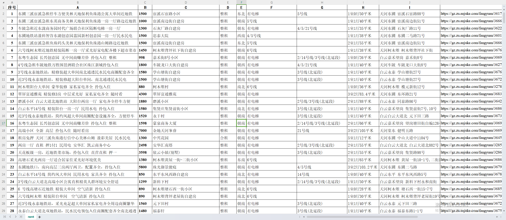
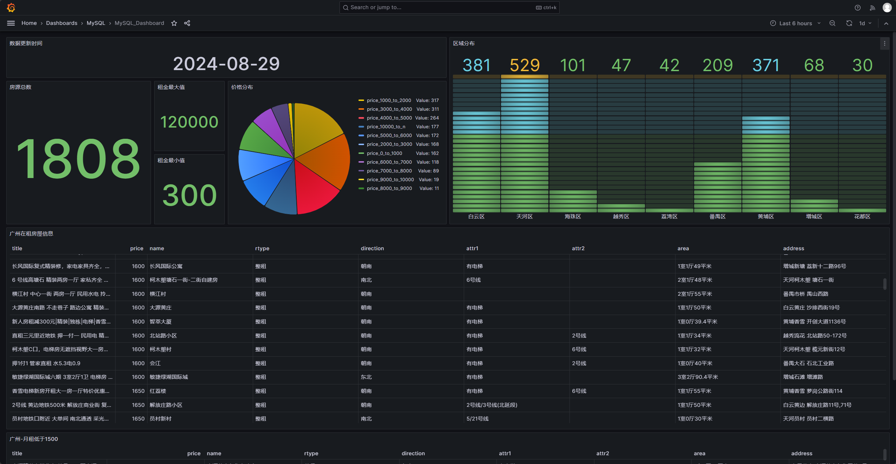

### RentHouse Scrapy
---

#### 介绍
---

本项目从"安居客"爬取租房信息

相关组件版本信息:
```
Scrapy 2.6.3
```
```
Python >= 3.8
```

本项目利用Grafana + MySQL来展示数据:

[租房信息展示](http://8.134.95.226:8089/grafana/d/d227a851-4ec9-4893-a508-a10e8e213196/mysql-dashboard?orgId=1&refresh=30m)

通过修改settings.py中的pipeline配置来获取csv格式的数据文件，执行以下命令控制pepelines配置:

1. 打开CSV文件输出
```bash
sed -i '/.*#.'rentHouse.pipelines.RentPipelines'/s/#//' settings.py
```

2. 关闭CSV文件输出
```bash
sed -i 's/'rentHouse.pipelines.RentPipelines'/#&/g' settings.py
```

3. 打开MySQL pipeline
```bash
sed -i '/.*#.'rentHouse.pipelines.RentPipelinesMysql'/s/#//' settings.py
```

4. 关闭MySQL pipeline
```bash
sed -i 's/'rentHouse.pipelines.RentPipelinesMysql'/#&/g' settings.py
```

#### 使用方法
---

修改pipelines.py文件中MySQL连接配置

```bash
        self.conn = pymysql.connect(
                host = '127.0.0.1',
                user = 'username',
                password = '********',
                database = 'scrapy_result'
        )

```

运行命令: 

```bash
cd rentHouse;scrapy crawl rent
```

默认起始URL: 

```bash
https://gz.zu.anjuke.com/?from=esf_list"
```

#### 效果
---
1. CSV文件


2. Grafana面板


